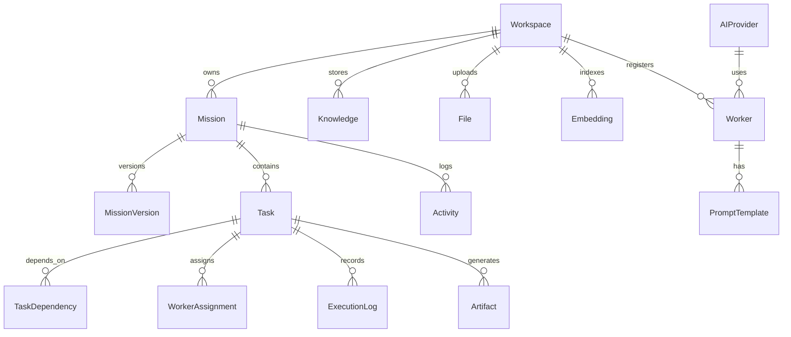

# HiveForge Enterprise Development Roadmap

This document incorporates the architectural refinements requested for a production-grade, highly scalable multi-agent monorepo.

---

## 1. Enterprise Architecture Blueprint

HiveForge separates business operations, orchestration routing, queue execution, worker runtimes, and model integrations into discrete modules.

```
Next.js (Frontend)
   │
   ▼ (WebSocket / REST API)
API Gateway / NestJS (apps/api)
   │
   ▼
Mission Service (Business Logic)
   │
   ▼
Planner Service (Dynamic Graph Generator)
   │
   ▼
Graph Builder (Resolves Task & TaskDependency)
   │
   ▼
Scheduler & Queue (BullMQ / In-Memory Queue)
   │
   ▼
Worker Runtime (Resolves Worker from WorkerRegistry)
   │
   ▼
AI Runtime (AIProvider Interface)
   │
   ▼ (Adapters)
[OpenAI / Anthropic / Fireworks / Google / Ollama]
```

---

## 2. Refined Package Monorepo Structure

We will organize the code using **Nx** into highly decoupled local packages:

```
packages/
├── ai-runtime/        # AIProvider interface, model adapters (Fireworks, OpenAI, etc.)
├── worker-runtime/    # WorkerRegistry, stateless worker executor logic
├── planner/           # Dynamic mission planning & graph generation
├── scheduler/         # Task runner, Queue wrapper (BullMQ / Redis / Memory queue)
├── graph/             # TaskDependency resolution and traversal logic
├── context/           # Context builder, RAG pipelines
├── shared/            # Common contracts, types, and schemas
└── database/          # Prisma database schema, clients, and migrations
```

---

## 3. Database Schema Design (15 Entities)

We normalize the data schema to support queryability, resumability, individual task retries, and version auditing.



### Table Specifications
1. **Workspace**: Multi-tenant isolation boundary.
2. **Mission**: Core business goal.
3. **MissionVersion**: Snapshot of a mission's state for rollback and auditing.
4. **Task**: Single step in the dynamic execution graph.
5. **TaskDependency**: Self-referencing link table joining `taskId` and `dependsOnTaskId` to normalize the execution DAG.
6. **Worker**: Registrations of available agents (Research, Finance, Legal, etc.).
7. **WorkerAssignment**: Run-time logs linking a Task execution instance to a specific worker.
8. **Artifact**: Output generated by tasks (e.g. Budget spreadsheet, Competitor MD reports).
9. **Knowledge**: Workspace contextual text data.
10. **Activity**: High-level lifecycle events for real-time WebSockets.
11. **ExecutionLog**: Raw stdout/stderr/LLM prompt logs of task runs for debugging.
12. **Embedding**: Vector embeddings mapped to knowledge snippets for semantic search.
13. **File**: Uploaded PDF/text source references.
14. **PromptTemplate**: Versioned prompts utilized by workers.
15. **AIProvider**: Registered LLM credentials (OpenAI, Anthropic, Fireworks).

---

## 4. Phase-by-Phase Roadmap

### Phase 1 — Foundation (Observability, Auth & Normalized DB)
- [ ] Spin up PostgreSQL & Redis (for BullMQ queues) via Docker Compose.
- [ ] Initialize Prisma in `packages/database` with the 15 normalized tables.
- [ ] Setup NestJS API (`apps/api`) and configure WebSocket gateway.
- [ ] Scaffold the base TypeScript compiler configurations inside the Nx monorepo.

### Phase 2 — Platform Core (Dynamic Orchestration Engine)
- [ ] **AI Abstraction**: Build `packages/ai-runtime` exposing `AIProvider` interface with support for Fireworks, OpenAI, and local Ollama mock adapters.
- [ ] **Dynamic Planner**: Create `packages/planner` to take a mission description and generate a list of normalized `Task` and `TaskDependency` entries dynamically.
- [ ] **WorkerRegistry**: Build `packages/worker-runtime` to load and instantiate worker definitions based on configuration (registry maps role keys to execution methods).
- [ ] **Queue-Based Scheduler**: Build `packages/scheduler` utilizing BullMQ to process tasks based on dependency completion, with concurrency limits and retry capabilities.

### Phase 3 — Digital Workforce (Worker Definitions & Context)
- [ ] Write worker definitions for **Research**, **Finance**, **Marketing**, and **Operations** as discoverable configurations.
- [ ] Build `packages/context` RAG context compiler to bundle previous task artifacts, notes, and workspace embeddings.
- [ ] Implement the `Composer` to aggregate generated artifacts into a unified Deliverable.

### Phase 4 — User Experience (Frontend & Socket Integration)
- [ ] Build Command Center page with **Dynamic Mission Composer** in `apps/web` (Next.js).
- [ ] Build **Live Graph Viewer** to display the running DAG nodes, node states (Pending, Running, Retrying, Complete), and log streams.
- [ ] Build **Artifact Center** to download, copy, or read generated worker reports.
- [ ] Integrate WebSocket connection hooks for live UI state updates.

### Phase 5 — Operations & Enterprise Polish
- [ ] Add Dockerfiles for `apps/web` and `apps/api`.
- [ ] Verify execution recovery: Kill api server mid-mission, restart, and confirm the Scheduler resumes from the last completed tasks.
- [ ] Configure telemetry/execution logging views in the dashboard.
