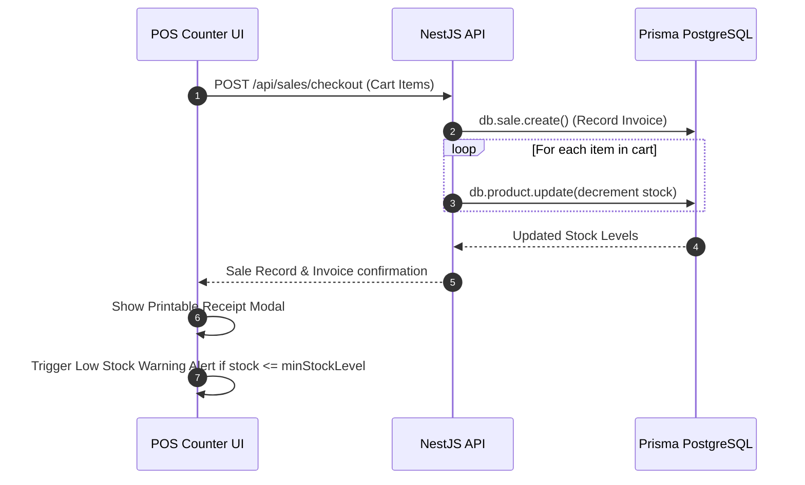

# 💳 POS Billing Counter & Inventory Technical Specification

## 📌 Overview

This document specifies the technical architecture, mathematical calculations, data payload schemas, and printable receipt invoice specs for the **POS Billing Counter** and **Inventory Catalog Management** modules of HiveForge.

---

## 🧮 Mathematical Formulas & Cart Logic

### 1. Line Item Total
For each item $i$ in the cart:
$$\text{LineTotal}_i = \text{Quantity}_i \times \text{SellingPrice}_i$$

### 2. Cart Subtotal
$$\text{Subtotal} = \sum_{i=1}^{n} \text{LineTotal}_i$$

### 3. Discount Amount
$$\text{DiscountAmount} = \frac{\text{Subtotal} \times \text{DiscountPercent}}{100}$$

### 4. Taxable Amount
$$\text{TaxableAmount} = \text{Subtotal} - \text{DiscountAmount}$$

### 5. GST Tax Amount
$$\text{TaxAmount} = \frac{\text{TaxableAmount} \times \text{TaxPercent}}{100}$$

### 6. Final Net Payable Total Amount
$$\text{TotalAmount} = \text{TaxableAmount} + \text{TaxAmount}$$

---

## 📄 Printable Tax Invoice Receipt Schema (`INV-2026-XXXX`)

```
=====================================================
            ACME RETAIL & UTILITIES
    Main Junction, Ayothiyapattanam, Salem
  GSTIN: 33ABCDE1234F1Z5 • Ph: 9876543210
=====================================================
            TAX INVOICE — INV-172401
=====================================================
Date: 19/08/2026                 Time: 10:35 AM
Customer: Walk-in Customer        Pay: UPI
-----------------------------------------------------
Item                       Qty x Rate         Amt
-----------------------------------------------------
Standard Student Notebook  2 x 30           ₹60.00
Pastel Highlighter Set     1 x 120         ₹120.00
-----------------------------------------------------
Subtotal:                                  ₹180.00
Discount (10%):                             -₹18.00
GST Tax (5%):                                +₹8.10
-----------------------------------------------------
NET PAYABLE:                               ₹170.10
=====================================================
       Thank You For Shopping With Us!
      Powered by HiveForge Digital Workforce
=====================================================
```

---

## 📡 API Endpoint & Data Schemas

### 1. Process Sale Checkout (`POST /api/sales/checkout`)

#### Request Body Schema:
```json
{
  "items": [
    {
      "productId": "p-1",
      "name": "Standard Student Notebook (200 pgs)",
      "price": 30,
      "quantity": 2,
      "lineTotal": 60
    }
  ],
  "subtotal": 180,
  "discount": 18,
  "tax": 8.1,
  "totalAmount": 170.1,
  "paymentMethod": "UPI",
  "customerName": "Walk-in Customer",
  "customerPhone": "9876543210"
}
```

#### Response Schema:
```json
{
  "id": "sale-1724083200",
  "workspaceId": "demo-ws",
  "invoiceNo": "INV-172401",
  "subtotal": 180,
  "discount": 18,
  "tax": 8.1,
  "totalAmount": 170.1,
  "paymentMethod": "UPI",
  "customerName": "Walk-in Customer",
  "customerPhone": "9876543210",
  "items": [...],
  "createdAt": "2026-08-19T10:35:00.000Z"
}
```

---

### 2. Product Inventory Management (`POST /api/products`)

#### Request Body Schema:
```json
{
  "name": "Calligraphy Art Marker Pack",
  "category": "Stationery",
  "costPrice": 100,
  "sellingPrice": 180,
  "stock": 50,
  "minStockLevel": 5,
  "barcode": "8901234567899"
}
```

---

## 📦 Stock Deduct & Alert Trigger Workflow


